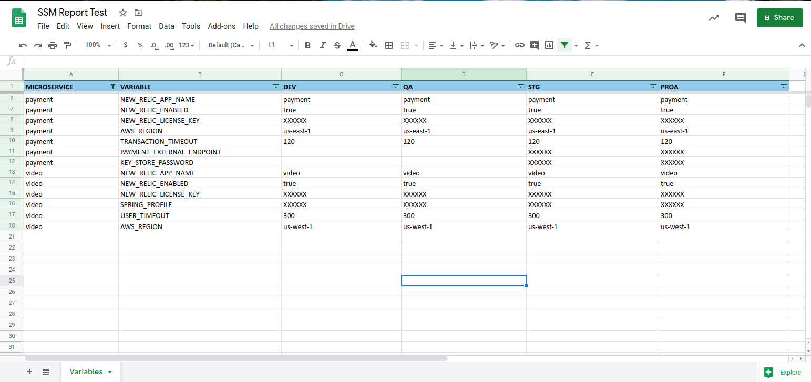

# ssm-parameter-store-report
Python script demo that generate a spreadsheet report of SSM variables created in Parameter Store

## AWS SSM Parameters Good Practice Structure Path

AWS System Manager Parameter store is a service that allows to management variables in a secure way, it allows the encryption of secrets using keys defined in AWS Key Management Service or KMS. This service allows access control to variables through security policies, version management, access from any AWS cloud service or through the AWS API.

In order to maintain an ordered structure for the creation of variables and access to them, it is necessary to create a structure in which it is easily identifiable which environment and service the variables belonged to:

Variable structure:
/PRESENTATION-LAYER/ENVIRONMENT/APPLICATION-NAME/VARIABLE-NAME

Example:
This is how the variable SPRING_PROFILE is defined for the video microservice in the dev environment in backend

/backend/dev/video/SPRING_PROFILE

This approach allows you to define variables and secrets for each one of the project applications and allows to execute the script without any change, if you have a different path structure you must make some changes in the script

## Create a Report

```
pip install -r requirements.txt
python ssm-parameter-store-report.py
ls
```

## Report Example


